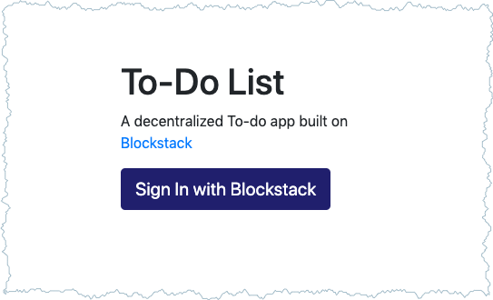
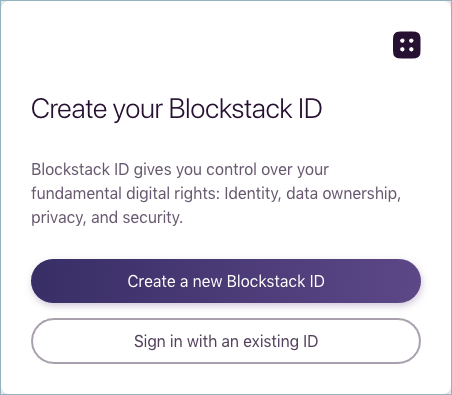

# Todo List
{:.no_toc}

In this tutorial, you build the code for and run a single-page application (SPA)
with Blockstack and React. Once the application is running, you take a tour
through the applications’ Blockstack functionality. You’ll learn how it manages
authentication using a Blockstack ID and how it stores information associated
with that ID using Blockstack Storage (Gaia).

* TOC
{:toc}



## Before you begin

The application you build is a React application that is completely decentralized and server-less. While not strictly required to follow along, basic familiarity with React is helpful. When complete, the app is capable of the following:

* authenticating users using Blockstack
* posting new statuses
* displaying statuses in the user profile
* looking up the profiles and statuses of other users

For this tutorial, you will use the following tools:

* your workstation's command line
- Node.js  v10 or higher is recommended the minimum supported version is Node.js v8.

The basic identity and storage services are provided by blockstack.js. To test the application, you need to have already registered a Blockstack ID.

### Verify you have Node.js and its tools installed

The tutorial relies on Node.js and its `npx` or `npm` tools. Before you begin, verify you have the correct version of Node.js and its tools installed.

```bash
$ node -v
v12.10.0
$ which npm npx
/usr/local/bin/npm
/usr/local/bin/npx
```

If you don't, make sure they are installed.

### Make sure you have a Blockstack ID

Finally, make sure you have [created at least one Blockstack ID]({{site.baseurl}}/browser/ids-introduction.html#create-an-initial-blockstack-id).
You’ll use this ID to interact with the application.

## Task 1: Install the code and retrieve the dependencies

You can clone the source code with  `git` or [download and unzip the code from the repository](https://github.com/blockstack/blockstack-todos/archive/master.zip). These instructions assume you are cloning.


1. Install the code by cloning it.

    ```
    $ git clone https://github.com/blockstack/blockstack-todos
    ```

2. Change to directory to the root of the code.

    ```
    $ cd blockstack-todos
    ```

    If you downloaded the zip file, the contents unzip into a `blockstack-todos-master` directory.


3. Use `npm` to install the dependencies.


    ```
    $ npm install
    ```

The Todo application has a basic React structure. There are several configuration files but the central programming files are in the `src/components` directory:

| File                    | Description                                 |
| ----------------------- | ------------------------------------------- |
| `index.js`              | Application initialization.                 |
| `components/App.js `    | Code for handling the `authResponse`.       |
| `components/Signin.js ` | Code for the initial sign on page.          |
| `components/Profile.js` | Application data storage and user sign out. |

## Task 2: Sign into the application

The example application runs in a node server on your local host. In the this section, you start the application and interact with it.

1. Make sure you are in the root of the code base.

   ```bash
    $ pwd 
    /Users/meepers/repos/blockstack-todos
   ```
   
   This path will be different for you, but double-check the last part to ensure that you're in the directory into which you cloned and in which you ran `npm install`.

2. Start the application in your local environment.

    ```bash
    $ npm run start
    ```
    
    You should see output similar to the following:

    ```bash
      Compiled successfully!

      You can now view bs-todo in the browser.

        http://127.0.0.1:3000/

      Note that the development build is not optimized.
      To create a production build, use npm run build.
      ```

2. Open your local browser to the `http://localhost:3000` URL.
  
    You should see a simple application:

    

 3. Choose **Sign In with Blockstack**.

    If you have already signed into Blockstack the application prompts you to select the ID to use. If you aren’t signed in, Blockstack prompts you to:

    

    If the login to the application is successful, the user is presented with the application:

    

## Task 3: Learn about the sign in process




## Task 4: Decode the authRequest

To decode the token and see what information it holds:

1. Copy the `authRequest` string from the URL.

   

2. Navigate to [jwt.io](https://jwt.io/).
3. Paste the full token there.

    The output should look similar to below:

    ```json
    {
      "jti": "f65f02db-9f42-4523-bfa9-8034d8edf459",
      "iat": 1555641911,
      "exp": 1555645511,
      "iss": "did:btc-addr:1ANL7TNdT7TTcjVnrvauP7Mq3tjcb8TsUX",
      "public_keys": [
        "02f08d5541bf611ded745cc15db08f4447bfa55a55a2dd555648a1de9759aea5f9"
      ],
      "domain_name": "http://localhost:8080",
      "manifest_uri": "http://localhost:8080/manifest.json",
      "redirect_uri": "http://localhost:8080",
      "version": "1.3.1",
      "do_not_include_profile": true,
      "supports_hub_url": true,
      "scopes": [
        "store_write",
        "publish_data"
      ]
    }
    ```

    The `iss` property is a decentralized identifier or `did`. This identifies the user and the user name to the application. The specific `did` is a `btc-addr`.

## Task 5: Under the covers in the sign in code

Now, go to the underlying `blockstack-todo` code you cloned or downloaded. Sign
in and sign out is handled in each of these files:

| File                    | Description                                 |
| ----------------------- | ------------------------------------------- |
| `components/App.js `    | Code for handling the `authResponse`.       |
| `components/Signin.js ` | Code for the initial sign on page.          |
| `components/Profile.js` | Application data storage and user sign out. |

The `src/components/App.js` code configures an `AppConfig` object and then uses this to create a `UserSession`. Then, the application calls a [`redirectToSignIn()`](https://blockstack.github.io/blockstack.js#redirectToSignIn) function which generates the `authRequest` and redirects the user to the Blockstack authenticator:

```js
...
const userSession = new UserSession({ appConfig })

export default class App extends Component {

  handleSignIn(e) {
    e.preventDefault();
    userSession.redirectToSignIn();
  }
...
```

Once the user authenticates, the application handles the `authResponse` in the `src/components/Profile.js` file. :

```js
...
componentWillMount() {
    if (userSession.isSignInPending()) {
      userSession.handlePendingSignIn().then((userData) => {
        //if (!userData.username) {
        //  throw new Error('This app requires a username.')
        //}
        window.location = window.location.origin;
      });
    }
  }
...
```

If [`isUserSignedIn()`](https://blockstack.github.io/blockstack.js/#isusersignedin) is true, the user was previously signed in so Blockstack pulls the data from the browser and uses it in our application. If the check on  [`UserSession.isSignInPending()`](https://blockstack.github.io/blockstack.js/#issigninpending) is true, a previous `authResponse` was sent to the application but hasn't been processed yet. The `handlePendingSignIn()` function processes any pending sign in.

Signout is handled in `src/components/App.js`.

```js
  handleSignOut(e) {
    e.preventDefault();
    userSession.signUserOut(window.location.origin);
  }
```

The method allows the application creator to decide where to redirect the user upon Sign Out:


## Task 6: Work with the application

Now, trying adding a few items to the todo list. For example, try making a list of applications you want to see built on top of Blockstack:


Each list is immediately stored in the Gaia Hub linked to your Blockstack ID.
For more information about the Gaia hub, [see the overview in this documentation]({{ site.baseurl }}/storage/overview.html#). Now that you have seen the application in action, dig into how it works.


## Task 7: Implement storage

Go to the underlying `blockstack-todo` code you cloned or downloaded. The application interactions with your Gaia Hub originate in the `src/components/Profile.js` file. First, examine where the changes to the Todos are processed in the `Profile.js` file.

The code needs to read the Todo items from the storage with the [`getFile()`](https://blockstack.github.io/blockstack.js/#getfile) method which returns a promise:

```js
  loadTasks() {
    const options = { decrypt: true };
    this.props.userSession.getFile(TASKS_FILENAME, options)
    .then((content) => {
      if(content) {
        const tasks = JSON.parse(content);
        this.setState({tasks});
      } 
    })
  }
```
The `todos` data is retrieved from the promise. By default, the `getFile()` decrypts data for you. For more information on the available options, see the <a href="https://blockstack.github.io/blockstack.js/interfaces/getfileoptions.html" taraget="_blank">the blockstack.js</a> library for details on the `GetFileOptions` interface.

During the creation of a  `todos`, a JSON object is passed in and the [`putFile()`](https://blockstack.github.io/blockstack.js/#putfile) method to store it in a Gaia Hub. By default, `putFile()` encrypts data when it stores it.

```js
saveTasks(tasks) {
    const options = { encrypt: true };
    this.props.userSession.putFile(TASKS_FILENAME, JSON.stringify(tasks), options);
  }
```


## Summary
{:.no_toc}

You now have everything you need to construct complex applications complete with authentication and storage on the Decentralized Internet. Why not try coding [a sample application that accesses multiple profiles](blockstack_storage.html).

If you would like to explore the Blockstack APIs, you can visit the [Blockstack Core API](https://core.blockstack.org/) documentation or the [Blockstack JS API](https://blockstack.github.io/blockstack.js).

Go forth and build!