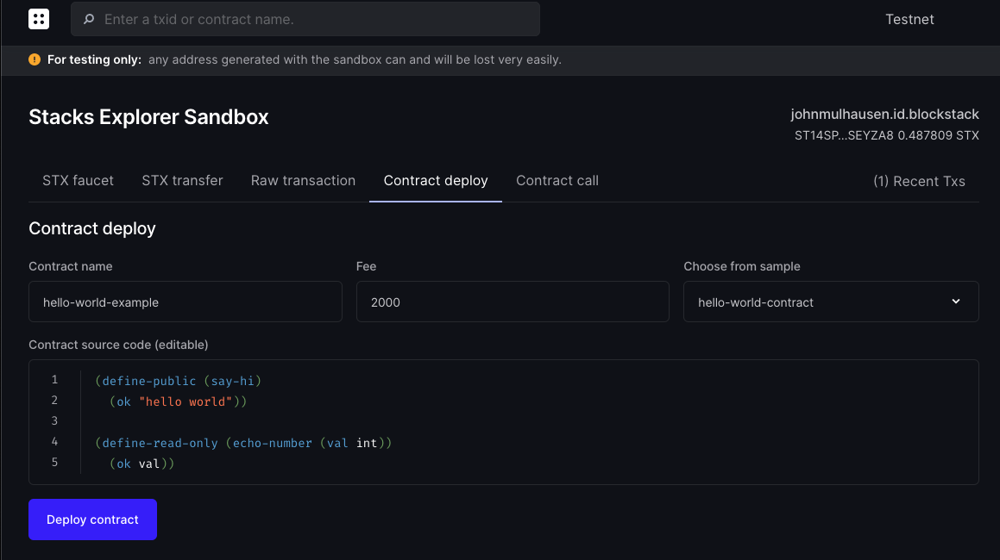
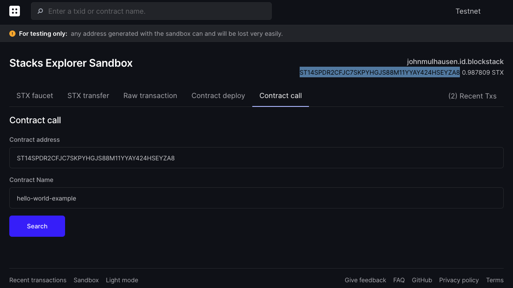

# Deploy and Interact

| Experience | | **Intermediate**  |
| Duration | | **15 minutes** |

In this tutorial, you learn how to deploy and interact with a smart contract on the Stacks 2.0 blockchain. By the end of this tutorial, you will ...

* Have a Clarity smart contract deployed to the Testnet that implements a counter
* Called public methods of the deployed smart contract
* Understand how to use the Explorer Sandbox functionality
* Understand how to use the Blockstack CLI for advanced capabilities

## Overview

* TOC
{:toc}



## Prerequisites

Before you get started, you should complete the [Counter tutorial](tutorial-counter.html). Make sure your `contracts/counter.clar` file looks like this:

```cl
 (define-data-var counter int 0)

 (define-public (get-counter)
   (ok (var-get counter)))

 (define-public (increment)
   (begin
     (var-set counter (+ (var-get counter) 1))
     (ok (var-get counter))))

 (define-public (decrement)
   (begin
     (var-set counter (- (var-get counter) 1))
     (ok (var-get counter))))
```

## Step 1: Accessing the Explorer Sandbox

Open up the [Stacks 2.0 Explorer Sandbox view](https://testnet-explorer.blockstack.org/sandbox). You will be asked to sign in with a Blockstack account, so you can sign transactions when interacting with the Blockchain. Follow the steps on the screen to complete the process.

Once completed, you will see the Sandbox screen and a confirmation, indicating you were provided with a new STX address for testing purposes.


## Step 2: Obtaining STX tokens

Uploading and calling smart contracts requires fees to be paid to the network to process the transactions. For this tutorial, we will limit out interaction to the Testnet, which comes with the capability to request STX tokens that can be used to pay the fees ("STX faucet").

Still on the first screen of the Sandbox, you will notice that you are looking at the ["STX faucet"](https://testnet-explorer.blockstack.org/sandbox?tab=faucet) tab. Your new STX address should already be prefilled. Hit "Submit" to request 0.5 STX to be transferred to your account.


A confirmation for a new transaction will pop up. Click on "View transaction" to review the pending faucet transaction. You might have to refresh the page a few times. In the next seconds, your transaction should be confirmed and you will see a token transfer success screen.


## Step 3: Deploying the counter contract

Go back to the Sandbox screen and switch to the ["Contract deploy"](https://testnet-explorer.blockstack.org/sandbox?tab=contract-deploy) tab. The screen has various options, but we will limit our updates to two fields:

* **Countract name**: Counter
* **Contract source code**: Contents of the `contracts/counter.clar` file (see [prerequisites](#prerequisites))


Verify your input and hit "Submit". A confirmation will pop up, indicating that a new contract deploy transaction was issued. Click on "View transaction" to review the pending transaction. You might have to refresh the page a few times. In the next seconds, your contract deployment should be confirmed and you will see a contract creation success screen.



As you can see on the screen, every smart contract's source code is publicly verifiable through the explorer.

## Step 4: Incrementing the counter

To update the counter, we have to call the public `increment` function of the contract. Go back to the Sandbox screen and switch to the ["Contract call"](https://testnet-explorer.blockstack.org/sandbox?tab=contract-call) tab. In the form, enter the following details:

* **Contract address**: Your generated STX address. Hover over the identity component on the right side of the screen to see your full address.
* **Contract name**: Counter



Verify your input and hit "Fetch" to look up available methods. You should see the 3 public methods implemented in the smart contract.

Locate the `(increment)` method, set the post condition mode to "Allow" and hit "Submit". A result confirmation will be displayed, indicating that a new contract call transaction was issued. Click on the transaction to review it. In the next seconds, your contract call should be completed and you will see a contract call success screen. Scroll down to the function summary section to verify your contract call:


**Congratulations! You just deployed your smart contract and called a public function on the Testnet.**

## Step 5: Get familiar with CLI (optional)

The steps above represent an easy way to get started with contract deployment and contract calls. If you want to stay in the terminal and get access to more advanced capabilities, you should use the Blockstack CLI.

The following set of commands will achieve the same goals as steps 1-4.

```shell
# Install early release of the new Blockstack CLI for Stacks 2.0
sudo npm install -g "https://github.com/blockstack/cli-blockstack#feature/stacks-2.0-tx"

# Create a new STX address and save keychain details to a file
blockstack make_keychain -t > new_keychain.txt

# Call faucet to get STX tokens, replace <stx_address>
curl -XPOST "https://sidecar.staging.blockstack.xyz/sidecar/v1/debug/faucet?address=<stx_address>" | json_pp

# Confirm faucet transaction, replace <stx_address>
blockstack balance <stx_address> -t

# Deploy a contract file, replace <stx_private_key>
blockstack deploy_contract ./counter.clar Counter 2000 0 <stx_private_key> -t

# Call increment method of deployed contract, replace <stx_address> and <stx_private_key>
blockstack call_contract_func <stx_address> Counter increment 2000 1 <stx_private_key> -t
```

To learn more about the Blockstack CLI commands, you can run `blockstack-cli help all`.

---

With the completion of this tutorial, you ...

* Deployed a Clarity counter smart contract to the Testnet
* Called public methods of the deployed smart contract
* Understood how to use the Explorer Sandbox functionality
* Understood how to use the Blockstack CLI for advanced capabilities

## Where to go next

{:.no_toc}

* <a href="principals.html">Guide: Understanding principals</a>
* <a href="clarityRef.html">Clarity language reference</a>
