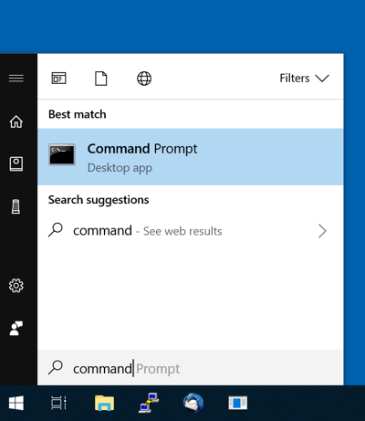

# Install the Stacks Wallet software


You use the Stacks Wallet software client alone or with a hardware wallet to
generate and manage the addresses for storing your Stacks token. On this page,
you learn how to install the Stacks Software wallet. This page contains the
following:

* TOC
{:toc}

If you have already installed the latest Stacks wallet, see [Use the Stacks
Wallet software](wallet-use.html) instead.





## Mac Installation

1. Select the **MacOS Download** button <a href="https://blockstack.org/wallet/" target="\_blank">on this page</a>.

   This button downloads the software to your computer.

2. Open a terminal window.

   To find the terminal software, enter `terminal` into the Spotlight search.

   

3. In the terminal window, enter the command to change directory to the folder where you downloaded the wallet software.

   The default location is the **Downloads** folder, type the following into the terminal and press RETURN on your keyboard.

   ```
   cd ~/Downloads
   ```

4. In the terminal window, type the following Command

    ```
    shasum -a 512 macos-stacks-wallet.dmg
    ```

    

5. Verify that the resulting hash (a string of letters and numbers) is the same as the latest hash published <a href="https://github.com/blockstack/stacks-wallet/releases" target="\_blank">on this page</a>.


## Windows Installation

1. Select the **Windows Download** button <a href="https://blockstack.org/wallet/" target="\_blank">on this page</a>.

   This button downloads the software to your computer.

2. Open a command prompt.

   To find the command prompt software, enter `command` into the Start menu.

   

3. In the command prompt window, enter the command to change directory to the folder where you downloaded the wallet software.

   The default location is the **Downloads** folder, type the following at the command prompt and press RETURN on your keyboard.

   ```
   cd <You-User-Directory>/Downloads
   ```

4. In the command prompt window, type the following at the command prompt.

    ```
    certUtil -hashfile windows-stacks-wallet.exe SHA512
    ```

    

5. Verify that the resulting hash (a string of letters and numbers) is the same as the latest hash published <a href="https://github.com/blockstack/stacks-wallet/releases" target="\_blank">on this page</a>.

## Additional software requirements

If you wish to use the Stacks Wallet software to send and receive Stacks, you
need to ensure you also have a hardware wallet and a Bitcoin account.

### Hardware wallet

If you have a paper wallet or a custodial wallet, you should setup. You can use
any of these hardware wallets with the Stacks wallet:

* <a href="https://trezor.io/" target="\_blank">Trezor</a> One
* Trezor Model T
* <a href="https://www.ledger.com/" target="\_blank">Ledger</a> Nano S
* Ledger Bluea hardware wallet.

For information on setting up a hardware wallet, refer to the vendor's
documentation. We cannot help you set up your hardware wallet.


### Bitcoin account for fuel

You use this account to load very small fractions of Bitcoin to fuel your wallet
transactions. For example, .00025 Bitcoin can fuel several transactions. You can
acquire this Bitcoin and send it to the Stacks Wallet via a Coinbase or other
Bitcoin account. Before you begin using the wallet transactions, make sure that
you have such an account. You must create this account yourself.
